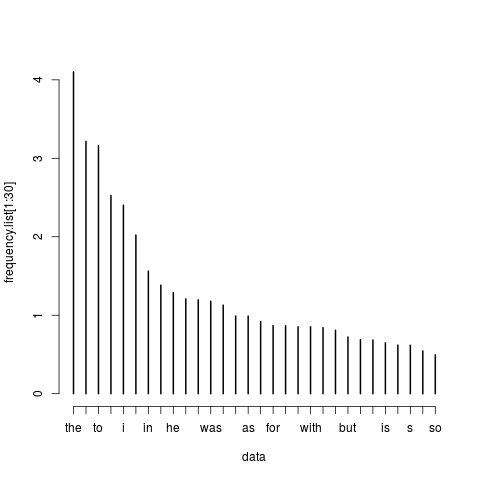

## Disclaimer
The presentation was adapted by Joanna Byszuk for the 'Stylometry with R' course at DHSI 2018 (co-taught by JB and JR) from the previous presentations on multidimensionality and distance measures created by Maciej Eder. Political system metaphors are of his invention.  
  
All calculations/word lists were based on *A Short Collection of British Fiction* corpus as available via [Computational Stylistics Group](https://github.com/computationalstylistics/A_Small_Collection_of_British_Fiction)

## Most frequent words - important?
{width=500px}

## Most frequent words - distribution
{width=550px}

## Zipf's law
Zipf's law states that given some corpus of natural language utterances, **the frequency of any word is inversely proportional to its rank in the frequency table**.  
   
Thus the most frequent word will occur approximately twice as often as the second most frequent word, three times as often as the third most frequent word, etc.: the rank-frequency distribution is an inverse relation.

## Zipf's law - rank/length dependence
* First ten: 
	* the, and, to, of, i, a, in, that, he, it  
* 100-110: 
	* made, miss, too, sir, shall, come, might, thought, himself, dear, make  
* 10000-10010: 
	* abel, accommodations, acquainting, acre, addicted, advertisement, area, assiduously, axe, balancing, bedad  

## Zipf's law - semantics
**The more frequent a word, the more meanings it has.**  
  
Think of the words that:
* are common in metaphors, e.g. *touch*, *drink*
* can function as various parts of speech, e.g.  *round* - verb, noun, adj, adv, prep

## Zipf's law - Principle of Least Effort
{width=550px}  
Image source: [learning libraries](http://learninglibraries.blogspot.com/2016/06/reflection-on-principle-of-least-effort.html)

## Zipf's law - Principle of Least Effort
* people naturally choose the path of least resistance, also when writing
* most authors use very uncommon words very rarely - this is sometimes measured with methods of *lexical richness*

## 1000 most frequent words - distribution
{width=500px}

## 100 most frequent words - distribution
{width=500px}

## 30 most frequent words - distribution
{width=500px}

## 10 most frequent words - distribution
{width=500px}

## How many words to choose?
A difficult question that we face as we need to consider:  
* which words are *really* important,  
* where to cut the wordlist to obtain valid feature set,  

## Are the words equally important?
The process of analysis of that consists of:  
* selecting of words  
* creating table of frequencies  
* using distance measures to assess similarity  

## But what is the "distance" between words or texts?
{width=400px}

## Two texts, one dimension, (just one word as a difference)
{width=700px}

## Two texts, one dimension, (just one word as a difference)
{width=700px}

## Two texts, two dimension (difference based on 2 words)
{width=700px}

## Constructing a two-dimensional space
{width=700px}

## Constructing a two-dimensional space
{width=700px}

## Two texts, two dimensions (difference based on two words)
{width=700px}

## Two texts, three dimensions (difference based on three words)
{width=700px}

## Constructing a three-dimensional space
{width=700px}

## Constructing a three-dimensional space
{width=700px}

## Two texts, three dimensions (difference based on three words)
{width=700px}

## Shall we try the fourth dimension? What would it look like?
{width=700px}

## Two texts, MANY dimension, one difference based on many words
{width=700px}

## One (hypothetical) difference in a multi-dimensional space?
{width=700px}

## Dimension reduction
Why do we need it?  
It's hard to visualise more dimensions than 3, and it's also hard to accurately compute and process multidimensional data. Each new unique word in a corpus adds a new dimension, so the number is rising to quite large values. 
  
*Now think of a spreadsheet of many columns and rows, and try to imagine it has so many further dimensions that it becomes a bit like in the last picture. Maybe it looks a bit like in Intestellar tesseract scene...?*

## Or think of "A Wrinkle in Time"'s explanation of time travel!
{width=700px}

## Two basic concepts related to dimension reduction:
* using a table (matrix) of distances (clustering, MDS)
* rotating a multidimensional space (PCA)

## PCA = Principal Components Analysis
* Basic concept: looking at data to find coordinates that represent the biggest amount of information - finding the most optimal representation.
* E.g. drawing a kettle so as to give most details of what it looks like might look like this:  
{width=400px}

## Information loss in PCA
* Components in PCA are sets of features which grant best information preservation, note however that they always have a value covering a relatively small percantage of all information.
{width=400px}

## Computing distances using table of frequencies
| word | ABronte_Agn | ABronte_Ten | Austen_Em | Austen_Pr | CBronte_Ja |
|:----:|:-----------:|:-----------:|:---------:|:---------:|:----------:|
| the  | 3.68        | 3.54        | 3.24      | 3.56      | 4.19       |
| and  | 4.00        | 4.01        | 3.04      | 2.94      | 3.54       |
| to   | 3.46        | 3.34        | 3.23      | 3.40      | 2.75       |
| of   | 2.34        | 2.23        | 2.67      | 2.96      | 2.33       |
| i    | 3.22        | 3.63        | 1.99      | 1.70      | 3.83       |
  
  
## Computing distances using table of frequencies
| word | ABronte_Agn | ABronte_Ten | Austen_Em | Austen_Pr | CBronte_Ja |
|:----:|:-----------:|:-----------:|:---------:|:---------:|:----------:|
| the  | **3.68**    | **3.54**    | 3.24      | 3.56      | 4.19       |
| and  | 4.00        | 4.01        | 3.04      | 2.94      | 3.54       |
| to   | 3.46        | 3.34        | 3.23      | 3.40      | 2.75       |
| of   | 2.34        | 2.23        | 2.67      | 2.96      | 2.33       |
| i    | 3.22        | 3.63        | 1.99      | 1.70      | 3.83       |

**|a1 - b1|**

## Computing distances using table of frequencies
| word | ABronte_Agn | ABronte_Ten | Austen_Em | Austen_Pr | CBronte_Ja |
|:----:|:-----------:|:-----------:|:---------:|:---------:|:----------:|
| the  | 3.68        | 3.54        | 3.24      | 3.56      | 4.19       |
| and  | **4.00**    | **4.01**    | 3.04      | 2.94      | 3.54       |
| to   | 3.46        | 3.34        | 3.23      | 3.40      | 2.75       |
| of   | 2.34        | 2.23        | 2.67      | 2.96      | 2.33       |
| i    | 3.22        | 3.63        | 1.99      | 1.70      | 3.83       |  
  
**|a1 - b1| + |a2 - b2|**

## Computing distances using table of frequencies
| word | ABronte_Agn | ABronte_Ten | Austen_Em | Austen_Pr | CBronte_Ja |
|:----:|:-----------:|:-----------:|:---------:|:---------:|:----------:|
| the  | 3.68        | 3.54        | 3.24      | 3.56      | 4.19       |
| and  | 4.00        | 4.01        | 3.04      | 2.94      | 3.54       |
| to   | **3.46**    | **3.34**    | 3.23      | 3.40      | 2.75       |
| of   | 2.34        | 2.23        | 2.67      | 2.96      | 2.33       |
| i    | 3.22        | 3.63        | 1.99      | 1.70      | 3.83       |    
  
**|a1 - b1| + |a2 - b2| + |a3 - b3|**

## Computing distances using table of frequencies
| word | ABronte_Agn | ABronte_Ten | Austen_Em | Austen_Pr | CBronte_Ja |
|:----:|:-----------:|:-----------:|:---------:|:---------:|:----------:|
| the  | 3.68        | 3.54        | 3.24      | 3.56      | 4.19       |
| and  | 4.00        | 4.01        | 3.04      | 2.94      | 3.54       |
| to   | 3.46        | 3.34        | 3.23      | 3.40      | 2.75       |
| of   | **2.34**    | **2.23**    | 2.67      | 2.96      | 2.33       |
| i    | 3.22        | 3.63        | 1.99      | 1.70      | 3.83       |   
  
**|a1 - b1| + |a2 - b2| + |a3 - b3| + |a4 - b4|**

## Computing distances using table of frequencies
| word | ABronte_Agn | ABronte_Ten | Austen_Em | Austen_Pr | CBronte_Ja |
|:----:|:-----------:|:-----------:|:---------:|:---------:|:----------:|
| the  | 3.68        | 3.54        | 3.24      | 3.56      | 4.19       |
| and  | 4.00        | 4.01        | 3.04      | 2.94      | 3.54       |
| to   | 3.46        | 3.34        | 3.23      | 3.40      | 2.75       |
| of   | 2.34        | 2.23        | 2.67      | 2.96      | 2.33       |
| i    | **3.22**    | **3.63**    | 1.99      | 1.70      | 3.83       |   
  
**|a1 - b1| + |a2 - b2| + |a3 - b3| + |a4 - b4| + |a5 - b5|**

## Computing distances using table of frequencies
| word | ABronte_Agn | ABronte_Ten | Austen_Em | Austen_Pr | CBronte_Ja |
|:----:|:-----------:|:-----------:|:---------:|:---------:|:----------:|
| the  | 3.68        | 3.54        | 3.24      | 3.56      | 4.19       |
| and  | 4.00        | 4.01        | 3.04      | 2.94      | 3.54       |
| to   | 3.46        | 3.34        | 3.23      | 3.40      | 2.75       |
| of   | 2.34        | 2.23        | 2.67      | 2.96      | 2.33       |
| i    | 3.22        | 3.63        | 1.99      | 1.70      | 3.83       |  

$\sum_{i=1}^{10} |a_i - b_i|$

## Why do we need distance measures?
You now know how to calculate distance between two words (or globally: two texts).   
The question remains:  
* are we doing it in the way that works best for language?  
* do we treat all the words the same if we know about Zipf's Law?  

## Stylometric distances as political systems
| Distance measure   | political system       |
|:------------------:|:----------------------:|
| Euclidean distance | tyranny                |
| Manhattan distance | oligarchy              |
| Classic delta      | democracy              |
| Eder’s delta       | feudal monarchy        |
| Eder’s simple      | politeia (res publica) | 
| Canberra           | people's revolution    |

## Euclidean distance 

A classic distance measure:
  
$\delta_{AB} = \sum_{i=1}^{n} \sqrt{|f_{i}(A)^2 - f_{i}(B)^2|}$  
  
where:  
n = the number of MFWs (most frequent words),  
$f_{i}$ = the frequency of a given word i,  
A, B = text samples being compared  

## Euclidean distance: Tyranny of the most frequent word
{width=500px}

## Manhattan distance

Another classic distance measure:  
  
$\delta_{AB} = \sum_{i=1}^{n} |f_{i}(A) - f_{i}(B)|$  

## Manhattan distance: Oligarchy, or a small group of rulers
{width=500px}

## Euclidean vs Manhattan
{width=500px}  
source: [Kan Nishida - blog.exploratory.io](https://blog.exploratory.io/finding-correlations-and-distances-with-multi-dimensional-scaling-1ea2d1147c1c)

## Classic delta
Delta distance as proposed by Burrows:   
$\Delta_{(AB)} = \frac{1}{n} \sum_{i=1}^{n} |\frac{f_{i}(A)-\mu_{i}}{\sigma_{i}}-\frac{{}f_{i}(B)-\mu_{i}}{\sigma_{i}}|$  
  
the same formula simplified (cf. Argamon, 2008): 
   
$\Delta_{(AB)} = \frac{1}{n} \sum_{i=1}^{n} |\frac{f_{i}(A)-f_{i}(B)}{\sigma_{i}}|$

## Classic delta: Democracy, or the same laws for all
{width=500px}

## Eder’s modification to the delta distance
A method introducing weights to give slightly more influence to words that are more frequent:     
  
$\Delta_{(AB)} = \frac{1}{n} \sum_{i=1}^{n} (|\frac{f_{i}(A)-\mu_{i}}{\sigma_{i}}-\frac{{}f_{i}(B)-\mu_{i}}{\sigma_{i}}| \times \frac{n-n_{i} + 1}{n})$  
  
the same formula simplified algebraically:  
  
$\Delta_{(AB)} = \frac{1}{n} \sum_{i=1}^{n} (|\frac{f_{i}(A)-f_{i}(B)}{\sigma_{i}}| \times \frac{n-n_{i} + 1}{n})$

## Eder's delta: Feudal monarchy, or the hierarchy of honors
{width=500px}

## Eder’s simple (i.e. an anti-Zipf normalization)
$\delta_{AB} = \sum_{i=1}^{n} |\sqrt{f_{i}(A)} - \sqrt{f_{i}(B)}|$ 

## Eder’s simple (monarchia mixta? politeia? res publica?)
{width=500px}

## Canberra
Another classic method:  
$\delta_{AB} = \sum_{i=1}^{n} \frac{|A_{i}|-|B_{i}|}{|A_{i} + B_{i}|}$

## Canberra: People's revolution?
{width=500px}

## Other methods implemented in stylo include

* Entropy
* Cosine Distance
* (Wurzburg) Cosine Delta
* Min-Max  
As of summer 2018, stylometric community is excited especially about Cosine Delta (Jannidis et al., 2015), as multiple tests have shown it to be most reliable and well adjusted to text analysis. You can read about it [here.](http://dh2015.org/abstracts)    
  
We will hopefully soon include these methods in plotted comparisions. You can easily find their mathematic formulas online.

## I want to know more!
PCA  
* [PCA for laymen - video](https://www.youtube.com/watch?v=BfTMmoDFXyE)
* [Growing difficulty explanation](https://stats.stackexchange.com/questions/2691/making-sense-of-principal-component-analysis-eigenvectors-eigenvalues?answertab=active#tab-top)

