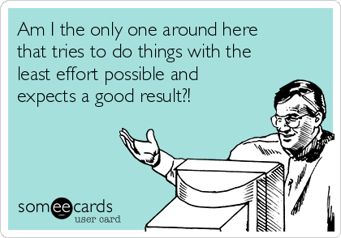

## Disclaimer
The presentation was adapted and updated based on the previous presentations on the same topic created by Maciej Eder. All the metaphors are of his invention.

## Most frequent words - important?
{width=500px}

## Most frequent words - distribution
{width=550px}

## Zipf's law
Zipf's law states that given some corpus of natural language utterances, *the frequency of any word is inversely proportional to its rank in the frequency table*. Thus the most frequent word will occur approximately twice as often as the second most frequent word, three times as often as the third most frequent word, etc.: the rank-frequency distribution is an inverse relation.

## Zipf's law - rank/length dependence
* First ten: 
	* the, and, to, of, i, a, in, that, he, it  
* 100-110: 
	* made, miss, too, sir, shall, come, might, thought, himself, dear, make  
* 10000-10010: 
	* abel, accommodations, acquainting, acre, addicted, advertisement, area, assiduously, axe, balancing, bedad  

## Zipf's law - semantics
The more frequent a word, the more meanings it has.

## Zipf's law - Principle of Least Effort
{width=550px}  
Image source: [learning libraries](http://learninglibraries.blogspot.com/2016/06/reflection-on-principle-of-least-effort.html)

## Zipf's law - Principle of Least Effort
* people naturally choose the path of least resistance
* also when writing

## 1000 most frequent words - distribution
{width=550px}

## 100 most frequent words - distribution
{width=550px}

## 30 most frequent words - distribution
{width=550px}

## 10 most frequent words - distribution
{width=550px}

## How many words to choose?
* which words are *really* important?
* where to cut the wordlist?

## Are the words equally important?
* selecting of words
* creating table of frequencies
* using distance measures to assess similarity

## Entropy

## Manhattan

## Canberra

## (Wurzburg) Cosine

## Min-Max

